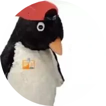

<div align="center">



# Patrizio

</div>

<!-- FIXME: add a link to the documentation gh page? -->

A [Delta Chat](https://delta.chat/) bot for group chats, built with Go. Patrizio responds to messages based on
configured keyword filters, inspired by [Miss Rose](https://missrose.org/) on Telegram. Its main aim is to be used in
friend groups or with people known. Differently from Miss Rose, it does not serve as a bot moderator, since Delta Chat
groups have no admin/member structure.

## Why Patrizio?

While it is not properly the penguin in the image, it comes from a funny Internet meme which was trending some time ago.
Since I am always out of ideas for good names, I thought it was a good pick. After all, who does not like penguins?

## Quick Start

### 1. Build

```sh
make build
```

### 2. Initialize the bot

Configure the bot with a Delta Chat email account:

```sh
./patrizio init bot@example.com YOUR_PASSWORD
```

### 3. Get the invite link

Share this link so users can contact the bot:

```sh
./patrizio link
```

### 4. Run the bot

```sh
./patrizio serve
```

The bot will connect to Delta Chat and start processing messages. Add it to a group to use keyword filters, or send it a
direct message to get help text.

## Configuration

Configuration is done via environment variables prefixed with `PATRIZIO_`:

| Variable              | Default         | Description                             |
|-----------------------|-----------------|-----------------------------------------|
| `PATRIZIO_DB_PATH`    | `./patrizio.db` | Path to the SQLite database file        |
| `PATRIZIO_MEDIA_PATH` | `./media`       | Directory where media files are stored  |
| `PATRIZIO_LOG_LEVEL`  | `info`          | Log level                               |

The bot's Delta Chat account data is stored in a platform-specific config directory (e.g. `~/.config/patrizio/` on
Linux), overridable with `--folder`:

```sh
./patrizio --folder /custom/path serve # --folder is optional, config will be saved in your user home otherwise
```

## Docker

Build and run with Docker (this assumes you've already initialized your bot instance):

```sh
make docker-build
docker run -v patrizio-data:/data patrizio -f /data serve
```

### Docker compose

If you prefer an orchestrated solution, you can use the included Docker Compose, which will build the image from the
source and serve it as it is. This is particularly useful if you do not want to rely on the provided Docker images, or if
you want to apply local edits. Before proceeding folder, a `./data` folder is mandatory in order for this setup to work
properly. It is also necessary to give the right permissions to the folder, so that the non-root user in the container
has access to it:

```sh
mkdir -p ./data/{media,db}
sudo chown -R 65532:65532 ./data # 65532 is the UID of the image.
```

Once setup, you have to populate the folder properly, which you can do with:

```sh
make docker-build
docker run --rm -v ./data:/data patrizio -f /data init
docker run --rm -v ./data:/data patrizio -f /data link
```

Then you can run it with:

```sh
docker compose up --build -d
```

> [!NOTE]
> The included Docker Compose has a built-in log rotation (up to 10MB)

## Development

### Setup

A Make directive is available for a quick project setup. Note that this will not install any dependencies, i.e. Golang,
Golint-ci and Pre-commit.

```sh
make project-setup
```

### Makefile Targets

| Target                            | Description                                                       |
|-----------------------------------|-------------------------------------------------------------------|
| `make project-setup`              | Setup project related hooks (doesn't install new software)        |
| `make build`                      | Compile the binary                                                |
| `make run`                        | Run the bot in serve mode                                         |
| `make test`                       | Run all tests                                                     |
| `make lint`                       | Run golangci-lint                                                 |
| `make docker-build`               | Build the Docker image                                            |
| `make migrate`                    | Run pending database migrations                                   |
| `make migrate-create NAME=<name>` | Create a new migration file                                       |
| `make sqlc`                       | Regenerate Go code from SQL query files                           |
| `make doc-activate-venv`          | Simply activate python `venv` for Zensical                        |
| `make doc-setup`                  | Command to only setup documentation (included in `project setup`) |
| `make doc-build`                  | Builds the documentation and output in `site` directory           |
| `make doc-local`                  | Serves the documentation locally, at `localhost:8000`             |
| `make clean`                      | Remove build artifacts                                            |

### Database Migrations

Migrations can be created with:

```sh
make migrate-create NAME=add_filters_table
```

This creates a new `.sql` file in `migrations/`. Edit it, then run:

```sh
make migrate
```

Migrations are also run automatically on bot startup.

### SQL Queries

SQL queries live in `queries/` as `.sql` files. After editing, regenerate the Go code:

```sh
make sqlc
```

Generated code is written to `internal/database/queries/`.

## AI disclamer

As can be see by the `openspec` folder, the heavy lifting of this project has been done by using AI (Claude, in
particular). This means, bootstrapping the project and adding the very first feature. I would never had enough time to
learn all the Delta Chat RPC basics and to start the project. I understand someone might not be OK with it, but by using
it and contributing, you accept this face. Other AI assistance tools will be used during the development, in particular
with the aim to explore and learn bot Delta Chat RPC and AI tools.

## License

AGPL-3.0-or-later. See [LICENSE](LICENSE) for the full text.
