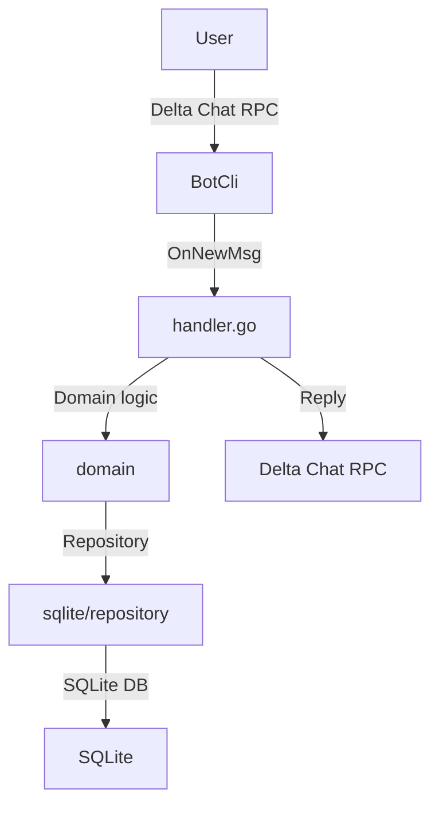

# Architecture Overview

Patrizio is a lightweight Delta Chat bot written in pure Go (1.25+).
The code is split into logical layers, each with a single responsibility.

## Layers

1. **Command Entry Point** – `cmd/patrizio/main.go`.
   * Loads configuration.
   * Creates media and database directories.
   * Opens the SQLite database.
   * Builds adapters and passes everything to the bot framework.

2. **Bot Framework** – `internal/bot/bot.go`.
   * Registers an `OnNewMsg` callback with the `deltabot‑cli‑go` library.

3. **Message Handler** – `internal/bot/handler.go`.
   * Decides if a message is a command, direct message, or group message.
   * Delegates command parsing to the domain layer.
   * Looks up filters via the repository.
   * Sends replies (text, media, reactions) via the Delta Chat RPC.

4. **Domain Layer** – `internal/domain/*`.
   * `filter.go` normalises triggers.
   * `command.go` parses commands.
   * Ports are defined here; implementations live in adapters.
   * All functions are pure and side‑effect‑free, making them easy to test.

5. **Adapters** – `internal/adapter/*`.
   * `sqlite/repository.go` wraps `*sql.DB` and forwards to the `sqlc`‑generated queries.
   * `storage/storage.go` handles media file I/O.

6. **Persistence** – `internal/database/queries/*`.
   * SQL queries generated by `sqlc`.

## Flow Diagram

## References

* `cmd/patrizio/main.go`
* `internal/bot/bot.go`
* `internal/bot/handler.go`
* `internal/domain/filter.go`
* `internal/domain/command.go`
* `internal/adapter/sqlite/repository.go`
* `internal/adapter/storage/storage.go`
* `internal/database/queries/*`
