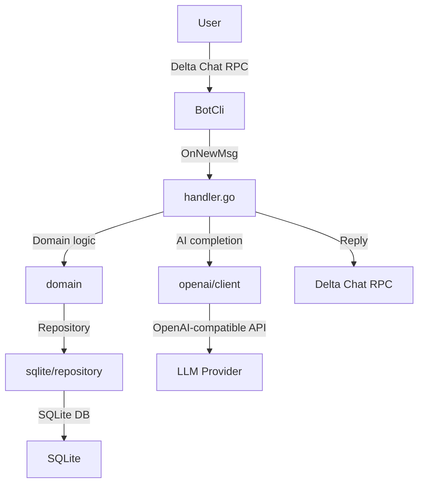

# Architecture Overview

Patrizio is a lightweight Delta Chat bot written in pure Go (1.25+). The code is
split into logical layers, each with a single responsibility. The whole
application tries to follow the Hexagonal architecture, having ports and
adapters, to keep elements isolated. We're also trying to avoid having functions
with side effects, pushing towards pure function calls.

## Flow Diagram

The code flow is basically the following:

<div align="center">



</div>

The deltabot-cli-go framework powers the bot.  `internal/bot/bot.go` registers two callbacks:

* **OnBotInit** - called once when the bot starts.  It's mainly a hook for future extensions.
* **OnNewMsg** - invoked for every message received.  This is where the bot does its work.

The `handler.go` plays a central role in parsing the incoming message and then calling the right handler, that will
process the message accordingly. Once the message has been processed, Delta Chat RPC is invoked to reply to the user
accordingly.

!!! note "About Delta Chat RPC"
    The component should have its own Repository, but
    for easiness of development we've decided to keep it inside the `bot`
    package. This will be addressed in the future.

### Message dispatching

The functionalities served between 1-to-1 chats (DMs) and Groups are different.

#### Group chats

For groups the handler first looks for bot commands (`/filter`, `/stop`, `/prompt`, etc.). If the text is a command,
it's parsed by the domain code. If the message is not a command, the handler checks whether it quotes a known
conversation message - if so, it's treated as a thread continuation and dispatched to the AI flow. Otherwise, the
message is normalised (lower-cased, punctuation removed) and the repository is queried for matching filters. Every
matching filter triggers a reply: text, media, or a reaction, with media files fetched from the storage adapter.

#### Direct chats

In a one-to-one conversation the bot first checks for the `/prompt` command, then for thread continuations (replies to
a previous AI message). If neither applies, it falls back to a short help message listing the available commands.

## Domain Ports

The `internal/domain/ports.go` file defines all port interfaces injected via `domain.Dependencies`:

| Port                     | Description                                                         |
|--------------------------|---------------------------------------------------------------------|
| `FilterRepository`       | CRUD for trigger/response filters (SQLite)                          |
| `ConversationRepository` | Thread message persistence for AI conversations (SQLite)            |
| `MediaStorage`           | Media file read/write (filesystem via afero)                        |
| `MemoryRepository`       | Per-chat `memory.md` blob + enabled flag                            |
| `ChatSettingsRepository` | Per-chat key/value settings (SQLite, keys like `memory.enabled`)    |
| `AIClient`               | OpenAI-compatible chat completions with optional tool-calling loop  |
| `ChatExecutor`           | Serializes per-chat operations (goroutine+channel worker)           |
| `Messenger`              | Delta Chat RPC send/receive abstractions                            |
| `Config`                 | Application configuration values                                    |

### `AIClient.ChatCompletion`

The signature accepts optional tools and a handler:

```go
ChatCompletion(ctx context.Context, messages []ChatMessage, tools []AITool, handler AIToolHandler) (ChatResponse, error)
```

When `tools` is `nil`, the adapter runs a simple single-shot completion. When tools are provided, it runs a
multi-turn loop (capped at `openai_max_tool_iterations`): execute tool calls via `handler.Handle`, append results,
repeat until the model returns a plain text response. `ChatResponse.MemoryWritten` is `true` if any `append_memory`
or `update_memory` call was made during the loop.

## Per-chat Concurrency

`internal/bot/chat_workers.go` implements `domain.ChatExecutor` using a goroutine-per-chat + channel pattern.

* One worker goroutine owns the job queue for each active chatID.
* Concurrent `/prompt`s in the same chat are serialized end-to-end (including the AI tool loop and `/memory clear`).
* Different chats remain fully parallel.
* Workers are process-lifetime in v1 (chat count is small). The `lastUsed` field is already in place for future
  idle-eviction via a background ticker.
* `Shutdown(ctx)` closes all worker `done` channels and waits for in-flight jobs to finish.
