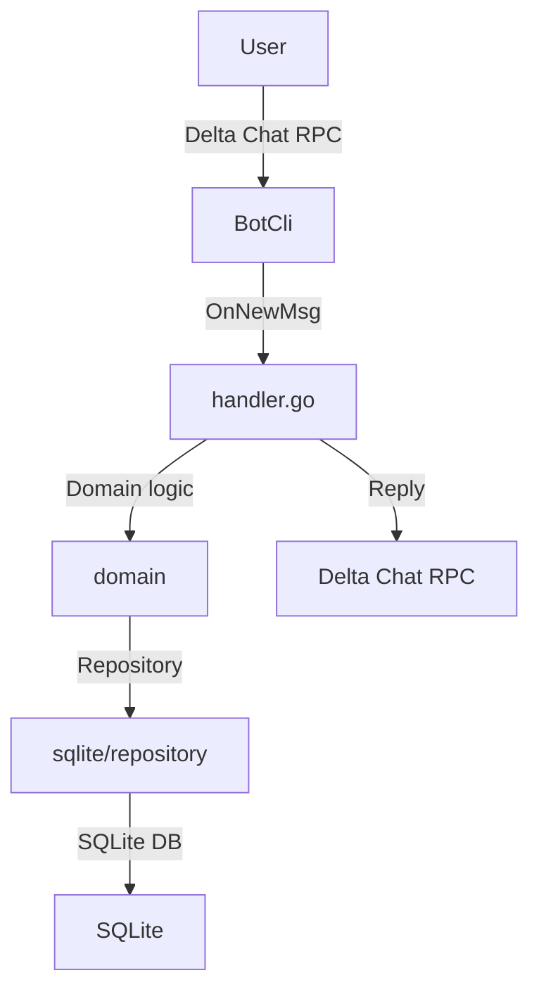

# Architecture Overview

Patrizio is a lightweight Delta Chat bot written in pure Go (1.25+). The code is
split into logical layers, each with a single responsibility. The whole
application tries to follow the Hexagonal architecture, having ports and
adapters, to keep elements isolated. We're also trying to avoid having function
with side effect, pushing towards pure function calls.

## Flow Diagram

The code flow is basically the following:

The deltabot‑cli‑go framework powers the bot.  `internal/bot/bot.go` registers two callbacks:

* **OnBotInit** – called once when the bot starts.  It’s mainly a hook for future extensions.
* **OnNewMsg** – invoked for every message received.  This is where the bot does its work.

The `handler.go` plays a central role into parsing the incoming message and then calling the right handler, that will
process the message accordingly. Once the message has been processed, Delta Chat RPC is invoked to reply to the user
accordingly.

!!! note "About Delta Chat RPC"
    The component should has its own Repository, but
    for easiness of development we've decided to keep it inside the `bot`
    package. This will be addressed in the future.

### Message dispaching

The functionalities served between 1-to-1 chats (DMs) and Groups are different.

#### Group chats

For groups the handler first looks for bot commands (`/filter`, `/stop`, etc.). If the text is a command, it’s parsed by
the domain code. If it’s not a command, the message is normalised (lower‑cased, punctuation removed) and the repository
is queried for matching filters. Every matching filter triggers a reply: text, media, or a reaction, with media files
fetched from the storage adapter.

#### Direct chats

In a one‑to‑one conversation the bot simply replies with a short help message – the logic is intentionally minimal.
