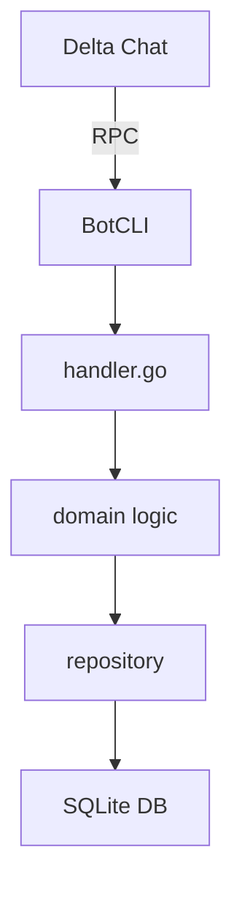

# FAQ – Frequently Asked Questions

## Why does my filter not trigger?

* Filters are matched as **whole words**. Use parentheses to group multiple triggers:

  ```bash
  /filter (hi, hello, "good morning") Hey!
  ```

Case-insensitive matching. Make sure you're not using a different character set.

## How do I handle large media files?

The bot streams media from Delta Chat. Files larger than the configured
limit (default 5 MB) are rejected. Adjust the limit in `patrizio.toml`:

```yaml
media:
  max_size_bytes: 10485760  # 10 MiB
```

## What if I want to add a new command?

All commands live in `internal/domain/command.go`.

Add a new entry to the `commands` map, implement logic in `handler.go`,
and write unit tests in the `*_test.go` files.

## Where can I find the architecture diagram?

See `docs/dev/architecture.md`. A Mermaid diagram is embedded below:



## How to run tests locally?

```bash
go test ./...
```

## Who maintains the project?

Patrizio is maintained by a small community. If you'd like to contribute, see the [CONTRIBUTING](CONTRIBUTING.md) guide.
